# Find Correct AnchorBox & Design Dataloader for Own Dataset (YOLOv4)
Images & annotation files are downloaded from Open Image dataset for Airplane & Bird classes & modified annotation files to yolo format (class_id, x_centre, y_centre, width, height)

## 1. Find AnchorBox 
Code: [find_anchor_bbox.ipynb](./find_anchor_bbox.ipynb)

Finally 3 anchors box are selected

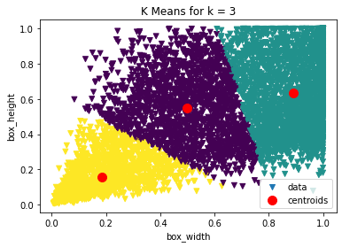

```python
# Selected 3 anchor boxes dimension(W,H)
anchors_norm = [[0.18547305, 0.15784538],
                [0.89261096, 0.63258077],
                [0.49992282, 0.55533295]]

# Selected Anchors for 320x320 image (anchors_norm*320)
anchors = [
           [[ 59 , 50]],
           [[159 , 177]],
           [[285 , 202]]
           ]
```

## 2. Dataloader 
Code: [Only_dataloader.ipynb](./Only_dataloader.ipynb)

Below Visualization for Dataloader Output 

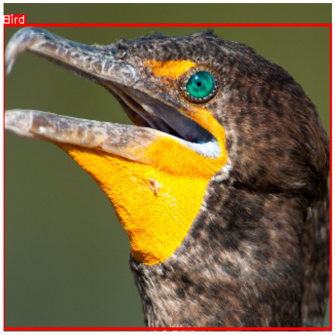
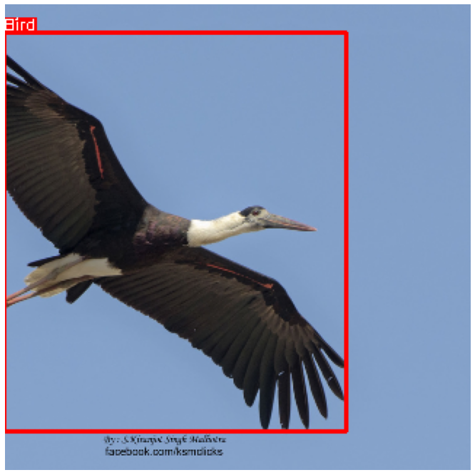
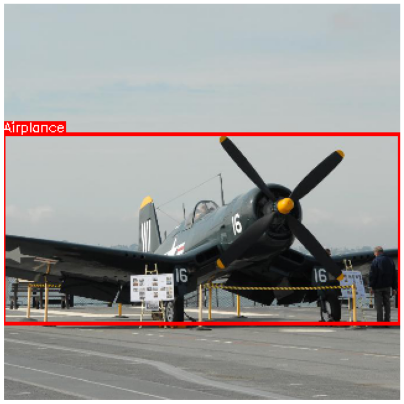
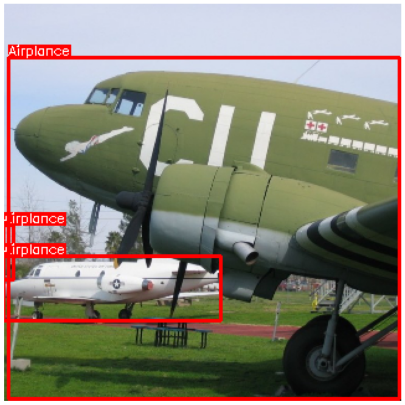
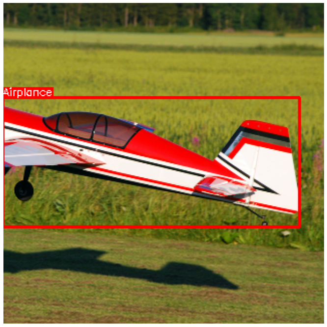
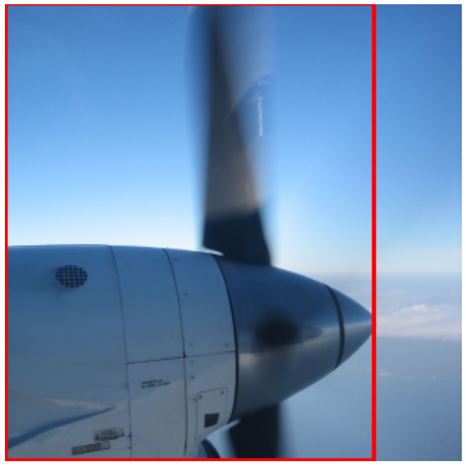
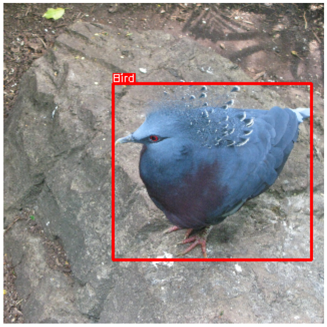
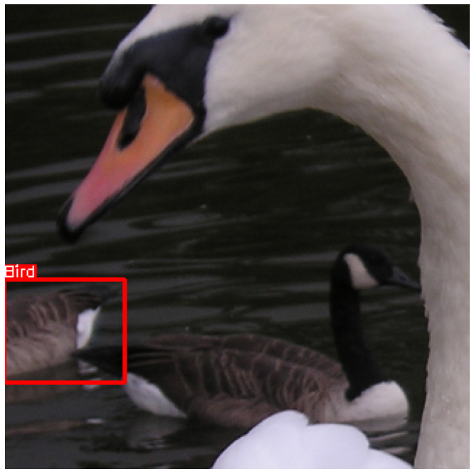
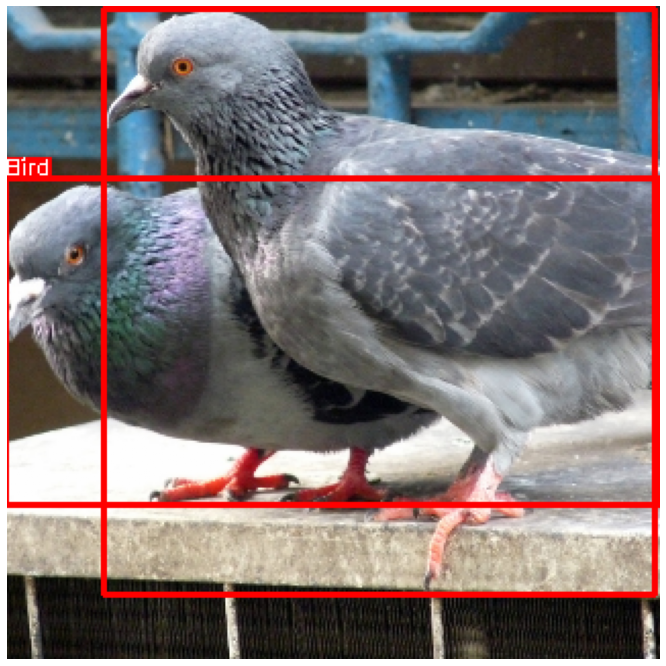
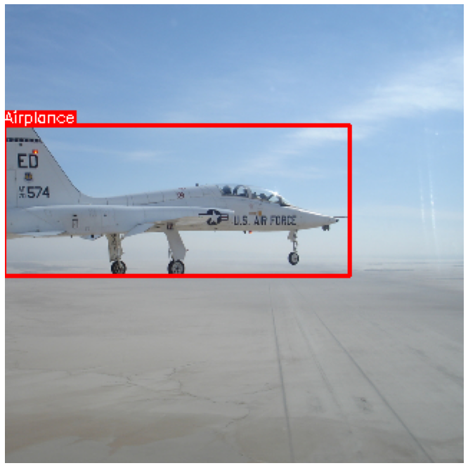
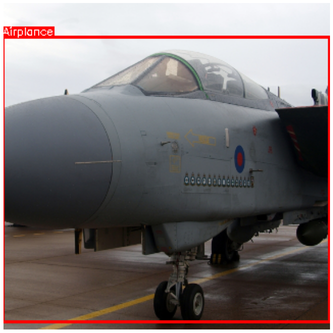
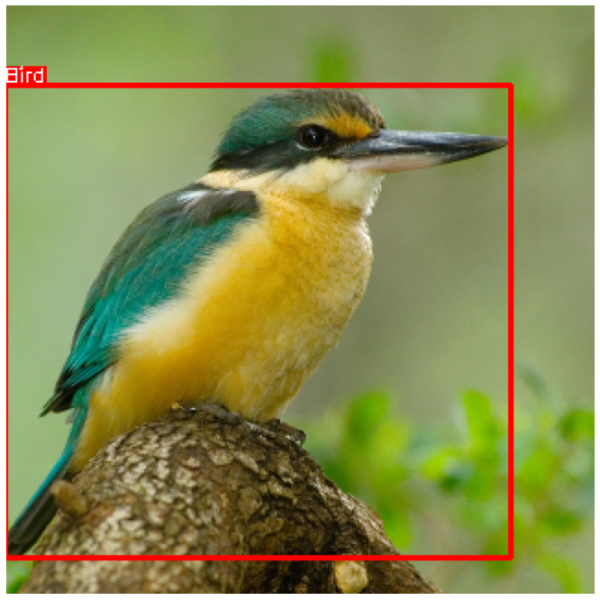
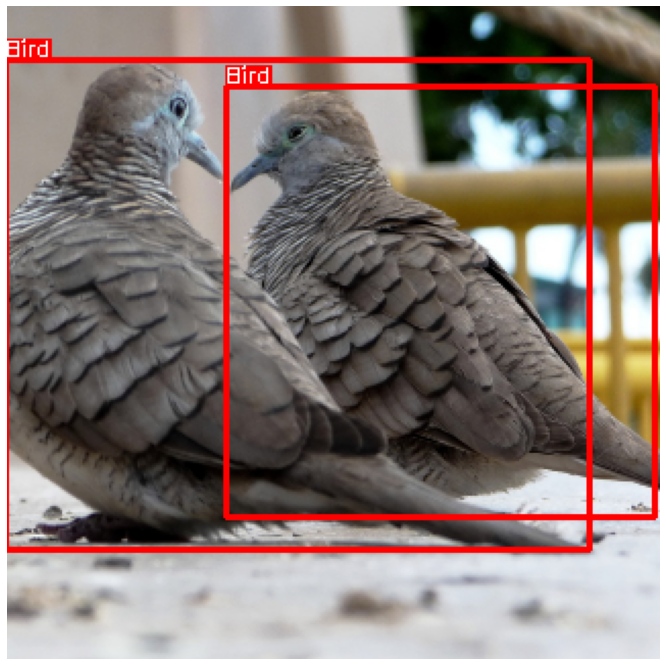
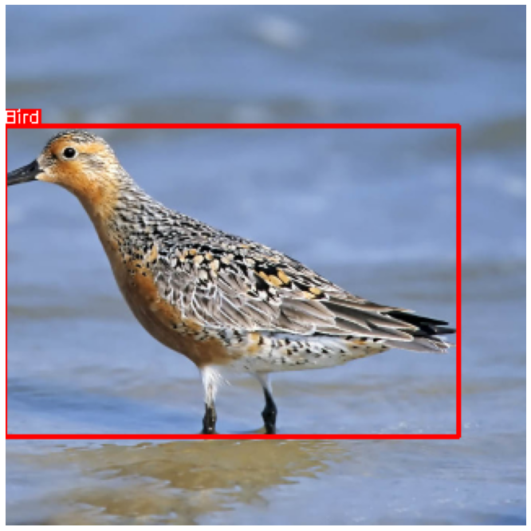
